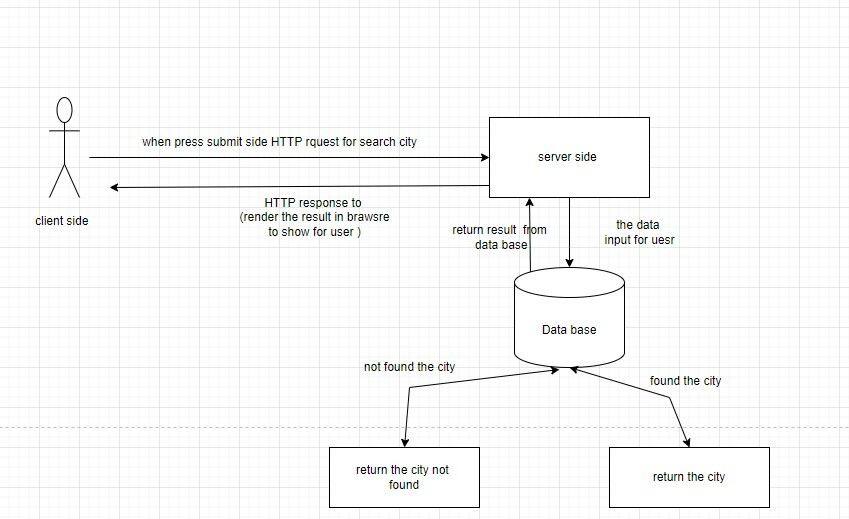

# Project Name

**Author**: Bayan Fuad Aljawawdeh
**Version**: 1.0.0 

## Overview
this application allowes the user to search about cities, and shows the map for them. 

## Getting Started
start planning and draw the data flow

## Architecture
technologies used : react, bootstrap , API
## Change Log
complete the task and add the map for the app.

## Credit and Collaborations
my friends Qais and Shaimaa helped me planning and drawing the data flwo

Name of feature: ______Asynchronous code, and APIs__________________________

Estimate of time needed to complete: __7hours___

Start time: __2:00pm___

Finish time: __12:00am___

Actual time needed to complete: _10 hours____

Name of feature: ___________APIs_____________________

Estimate of time needed to complete: __5 hours___

Start time: __9:00am___

Finish time: _3:00pm____

Actual time needed to complete: ___6 hours__

**Author**: Bayan Fuad Aljawawdeh
**Version**: 2.0.0 

## Overview 

We need to create and build our own server and connect it with App we create to the data from our server.
link the server with the app to send the data.

## Getting Started

install libraries.
create the server.
link the server with the app to send the data.

## Architecture  

-ReactJS
-Bootstrap
-Axios
-LocationIQ
-Dotenv

## Change Log

Application now has a fully-functional search with a GET route for the location resource and displays map image and an error.

## Credit and Collaborations

thanks for my group Qais and Shaimaa for the help.
[Shaimaa](https://github.com/Shaima-Alkhateeb)
[Qais](https://github.com/qais-alsgher)

Name of feature: __Custom Servers with Node and Express____________________

Estimate of time needed to complete: __7hours___

Start time: __2:00pm___

Finish time: __12:00am___

Actual time needed to complete: _10 hours____

Estimate of time needed to complete: _Refactoring into Modules____

Start time: ___8:00pm__

Finish time: _9:00pm____

Actual time needed to complete: __1 hour___

Estimate of time needed to complete: _Refactoring into Modules____

Start time: ___9:00pm__

Finish time: _9:20pm____

Actual time needed to complete: __20 mins___

